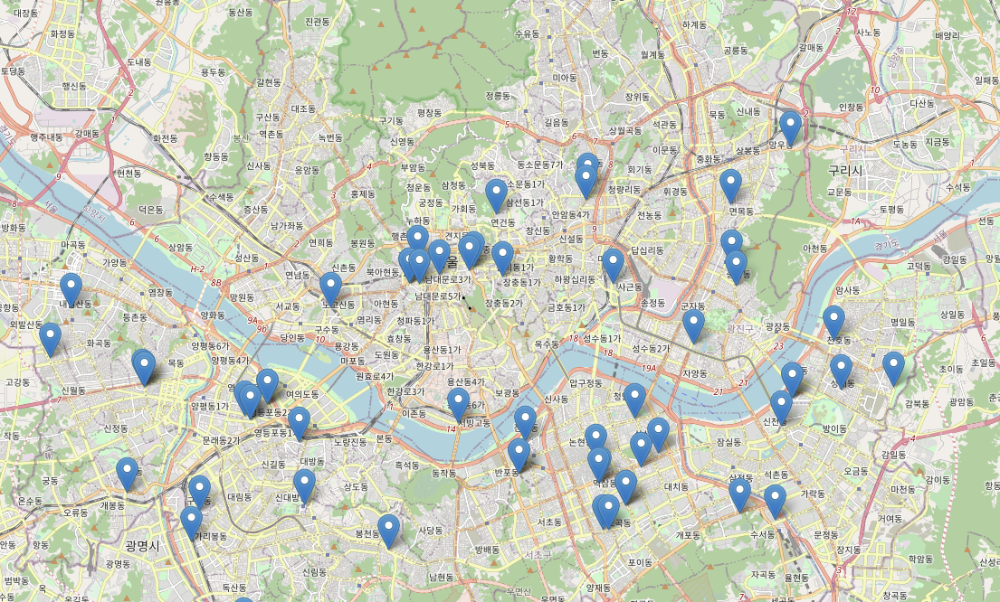

# DataScience_Starts_with_Python
[부스트코스] 파이썬으로 시작하는 데이터 사이언스 강의 클론입니다.

## 목표
1. 공공데이터를 통해 분석 steps 배우기
2. 데이터 전처리 실습
3. 시각화 실습
4. 인사이트 얻기
5. pandas, numpy, matplot 등 모듈 스킬 레벨 업   
=> 데이터 분석 능력 키우기 및   
     
       
## 서울_종합병원 데이터 분석 및 분포 리뷰 
#### 수행
1) 서울종합병원분포확인_공공데이터_프리뷰
2) 결측치 handling
3) 기초통계값(describe)이용_문자열, 숫자
4) 문자열 데이터 요약, pandas 로 시각화
5) 데이터 요약, seaborn 으로 빈도수 시각화
6) 하는 데이터만 따로 추출해 오기 - 데이터 색인하기
7) 텍스트 데이터 전처리_ 시군구별 특정 키워드 제외
8) 위경도 데이터 scatterplot 으로 표현
9) folium 위,경도와 주소 데이터를 활용해 지도에 표시하기   
    완성 (index.html)    

## 이후 목표
= 다음 목표는 직접 문제의 정의부터 가설 설정, 데이터 수집, 전처리, 시각화 하여 인사이트 얻기.
